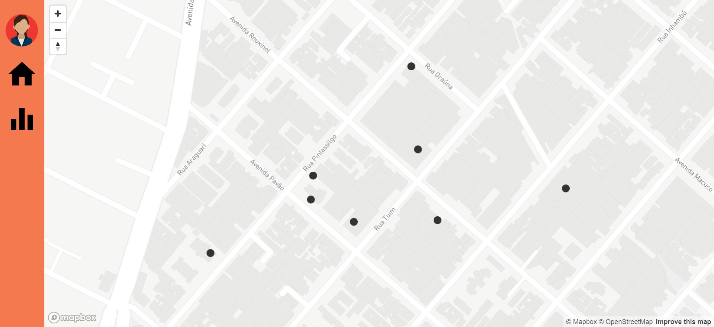
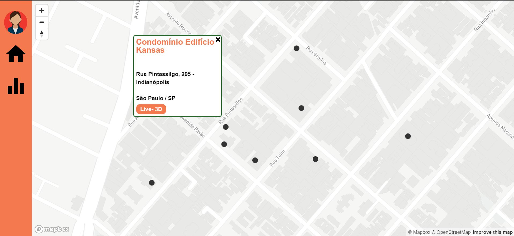
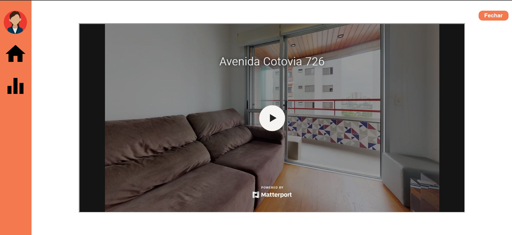
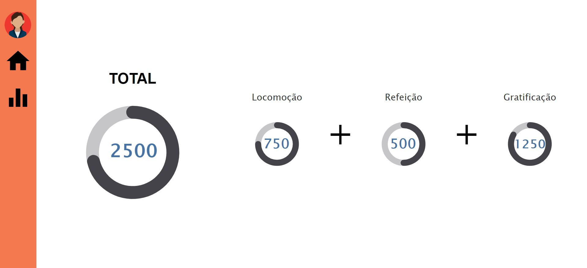

# Top Brokers Painel

<a href="https://jovial-tereshkova-383847.netlify.com/">Top Brokers Painel</a>

Desenvolvido em React JS para Mega Hack 2020 organizado pela Shawee.

## A solução

<a href="https://youtu.be/uWW9DDxPD68">Video Explicativo</a>

Para auxiliar no engajamento do Corretor na plataforma da Loft, apresentamos o programa de parcerias para os corretores mais engajados no TOP BROKERS com recompensas em 3 categorias:
- Locomoção: através de parcerias com empresas de mobilidade: Uber, Cabify, 99 Taxis
- Refeição : iFood, Uber Eats
- Gratificação: concedido por meios de pontos no cartão de crédito: NuBank  ou por cashback com PicPay e Méliuz. 
A restituição da recompensa se dará após atingida determinada pontuação, um voucher para uso nas categorias de locomoção/refeição e pontos no cartão no caso de gratificação.

## Imagens da Aplicação

Mapa (Visão Corretor)

Detalhes

Camera 3d

Relatórios + Bonificação

## Instalação

yarn install ou npm install

## Execução

yarn start

Abra [http://localhost:1234](http://localhost:1234) em seu browser.

## Time

>[ Joel Melo | Business ](https://www.linkedin.com/in/joeldemelo/) 
>[ Nathália Santiago | Developer](https://www.linkedin.com/in/santiagonathalia/) 
>[ Leonardo Santos | Developer](https://www.linkedin.com/in/leosantosbh/) 
>[ Daniele Misani | UX Designer](https://www.linkedin.com/in/danipishinin/) 
>[ Kleidmilson Ibiapina | Marketing](https://www.linkedin.com/in/kleidimilson-ibiapina-151266166/) 

## Licença

 
    
   
   

